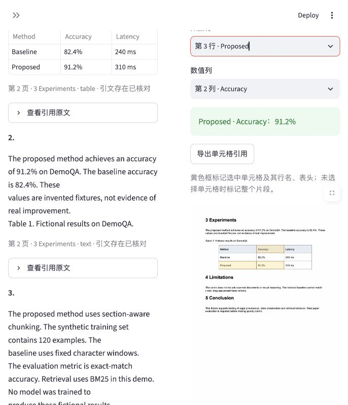
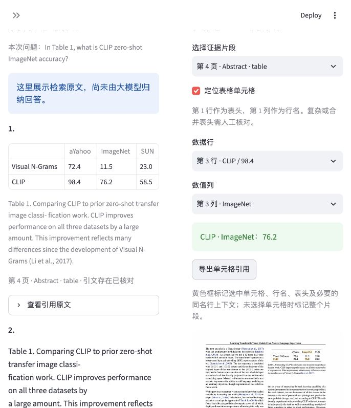
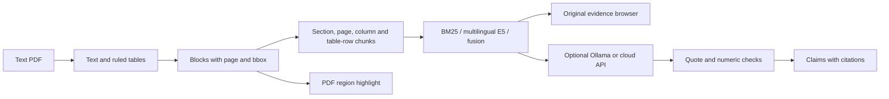

# PaperEvidence

Look up experimental values in a paper, then inspect the method, metric and highlighted PDF source together.

[中文说明](README.zh-CN.md) · [Development plan](docs/PLAN.zh-CN.md)

An early local evidence inspection tool for text PDFs. Start with a real CLIP paper and click an example, or upload your own paper. The value lookup needs no API key or model weights. It matches parsed method and metric labels, preserves grouped headers where their source geometry is supported, and exports source coordinates. Free-form BM25, multilingual E5 and hybrid retrieval remain available separately.


Actual browser capture, evidence-only mode. Source: Radford et al. (2021), PMLR, CC-BY-4.0; [asset attribution](demo/README.md). No generated answer was used. **OCR, figure understanding, formula recognition and neural reranking are not implemented.**

## Run the demo

Use Python 3.11 or 3.12 in a virtual environment:

```bash
python -m venv .venv
source .venv/bin/activate
python -m pip install -r requirements.txt
streamlit run app.py
```

On Windows, activate with `.venv\Scripts\activate`. The app opens the real CLIP demo. Click **下载真实论文并开始** to fetch the official PDF with hash verification, then **CLIP 的 ImageNet 准确率** to inspect a source cell. Startup does not download anything. If the publisher is unavailable, upload a text PDF or choose **虚构演示论文** in the sidebar; its values are invented test data.

## Command line

```bash
python -m paper_evidence ingest examples/demo-paper.pdf --out data/demo.json
python -m paper_evidence ask "What accuracy did the proposed method achieve?" --index data/demo.json
```

The default response is extracted evidence, not an LLM-generated answer. To generate an answer, start a local Ollama server, download a model suited to your hardware, and pass its name:

```bash
python -m paper_evidence ask "What accuracy did the proposed method achieve?" --index data/demo.json --model YOUR_DOWNLOADED_MODEL
```

The local adapter uses `/api/chat`, JSON output, temperature 0 and seed 42. Generated claims must cite retrieved chunk IDs and verbatim quotes. Unknown IDs, fabricated quotations, malformed outputs and numeric tokens absent from quoted evidence are rejected. **Quote existence and number presence do not prove semantic entailment or answer correctness.** Calculations and normalized representations such as `91.2 percent` versus `91.2%` can be rejected; support needs explicit evaluation before loosening these rules.

## Browse without a question

Open **逐页浏览论文（无需提问）**, enable the browser, and select a PDF page. Compare the full original page with all parsed fragments, text fragments or recognized tables. Inspect a cell or export a source fragment and its block coordinates even when retrieval misses it. Pages without indexable text remain viewable; OCR is still unavailable. The table filter counts recognized structures, not every table in the PDF.

Downloaded examples are discovered from corpus manifests and shown only after PDF hash verification. The app never downloads papers during startup. Source excerpts and retrieval results share the same cell inspector, and value columns without usable geometry are excluded.

## Look up an experimental value

Under **查实验数值**, enter the source method/model label and metric, then click **查找数值**. For grouped headers use a full path such as `BLEU / EN-DE`. Whitespace, case, underscores, parentheses and hyphens are normalized; aliases, calculations and unit conversions are not inferred. All matching cells across parsed tables are considered. Multiple matches require a source selection; no match does not mean the paper lacks the data.

Example buttons contain labels only, without stored answers, pages or coordinates. They invoke the same generic lookup as your inputs. This table scan is separate from top-k retrieval, so a successful demo is not a retrieval-quality metric.

## Inspect a table cell

Select a table source, enable **定位表格单元格**, and choose its data row and value column. The app displays a source-derived value such as `Proposed · Accuracy: 91.2%`, highlights the row label, column header and value cell, and exports their coordinates.



For generated numeric claims citing a table, the model must return only `{"table_value":{"chunk_id":"ID","row":2,"column":1}}`. Coordinates are zero-based. The application reads labels and values from the parsed source; the model cannot supply a replacement value or free-form text for that claim. Citing a whole table is insufficient to validate a numeric claim. Evidence-only browsing continues to show the whole original table.

This adapter assumes the first row is the header and the first column is the row label. Duplicate row labels include available source context, such as architecture, in the citation and highlight. Row indices are local to the retrieved fragment; long tables repeat their header and caption. Empty, spanning, merged or multiline selected cells are rejected. Supported parent headers are also highlighted; unsupported headers fall back to text. **A correct source cell may still answer the wrong question; tables misparsed as plain text are still subject only to quote and numeric-presence checks.** Indexes now use schema 3 for source header paths. Schemas 1 and 2 remain readable; re-ingest their PDFs to obtain new geometry and grouped headers.



The screenshot shows a highlighted source preview from Radford et al. (2021), [Learning Transferable Visual Models From Natural Language Supervision](https://proceedings.mlr.press/v139/radford21a.html), PMLR 139, CC-BY-4.0. Highlight overlays were added by this app; see [asset attribution](demo/README.md).

## Multilingual retrieval

Install the optional CPU embedding dependencies and explicitly download the model:

```bash
python -m pip install -r requirements-semantic.txt
python scripts/prepare_embedding.py
python -m paper_evidence ask "提出的方法准确率是多少？" --index data/demo.json --retriever hybrid --k 3
```

The download script pins [multilingual-e5-small](https://huggingface.co/intfloat/multilingual-e5-small) to commit `614241f622f53c4eeff9890bdc4f31cfecc418b3` and records its provenance. The weights are roughly 470 MB and are downloaded once; subsequent embedding inference loads local weights. Select **多语言语义** (dense) or **关键词与语义融合** (hybrid) in the sidebar. BM25 remains the default and needs no weights.

The adapter uses E5's `query:` and `passage:` prefixes, normalized cosine similarity and overlapping windows within its 512-token input limit. A long source chunk is ranked by its best window while retaining the original page, text and boxes. Hybrid retrieval uses reciprocal rank fusion with constant 60 and up to 20 candidates per retriever. Scores are ranking signals, not answerability probabilities. Local `.cache/embeddings/` files cache vectors; source content and model revision changes invalidate the index key. Remove that directory to clear the vector cache.

## Cloud answers

See [the setup guide](docs/SETUP.zh-CN.md) and [config.example.toml](config.example.toml). Copy the example to `config.toml`, configure your provider and set the named API-key environment variable locally. The example uses Alibaba Cloud Model Studio's [compatible Chat Completions endpoint](https://help.aliyun.com/zh/model-studio/qwen-api-via-openai-chat-completions).

```bash
python -m paper_evidence ask "提出的方法准确率是多少？" --index data/demo.json --retriever hybrid --provider compatible
```

Cloud mode sends the question and retrieved excerpts to the configured service only when selected. It enforces an evidence character budget and output token limit, records available token usage, rejects truncated replies, and does not automatically retry failed requests. JSON output support and provider-specific options vary: remove `enable_thinking` for other services and set `json_mode = false` if unsupported. **Cloud transport and validation have been tested offline; a real cloud generation has not yet been verified with credentials.** Local embedding inference has been run with real model weights.

## Evaluation

```bash
python -m pip install -r requirements-dev.txt
python -m unittest discover -s tests -v
python eval/retrieval_eval.py --out eval/results.json
# Requires the optional semantic dependencies and prepared weights:
python eval/semantic_eval.py
```

The small included QA fixture checks annotated evidence recall at k, using the same parsed blocks, retriever and character budget for fixed-window and section-aware chunking. It reports results even if the baseline wins. It does not measure generated-answer accuracy or hallucination rate. Use `--pdf YOUR_PAPER --qa YOUR_ANNOTATIONS` for real experiments and split development versus held-out questions before tuning.

The multilingual smoke test uses the same eight chunks and seven facts paired in English and Chinese. Recorded Evidence Recall@3:

| Retriever | English (7) | Chinese (7) |
| --- | --- | --- |
| BM25 | 1.0 | 0.0 |
| E5 dense | 1.0 | 1.0 |
| BM25 + E5 fusion | 1.0 | 1.0 |

These are fictional fixture results, not evidence of real-paper quality gains. The three unanswerable probes still produce semantic candidates; retrieval does not implement calibrated abstention. [Raw results](eval/semantic-smoke-results.json) include model revision, document and annotation hashes, per-query evidence recall and timings. [Verification notes](docs/VERIFICATION.zh-CN.md) distinguish model inference, offline API tests and unverified behavior. CI runs deterministic retrieval tests without downloading model weights.

### Real-paper development corpus

```bash
python scripts/fetch_real_papers.py
python eval/real_eval.py --out eval/real/v0.5-development-results.json
# Lexical evaluation without embedding weights:
python eval/real_eval.py --retrievers bm25 --out eval/real/bm25-results.json
```

Three PMLR papers, 12 source facts paired across English and Chinese (24 answerable queries), and three unanswerable probes are included as annotation drafts. PDFs are fetched separately from their official publisher and verified against pinned hashes. The retained v0.4 run retrieves the annotated quote and its PDF region in the top three chunks for **18/24 BM25 queries, 9/24 dense queries and 14/24 hybrid queries**. All six annotated table facts have usable source cell structure; top-3 bound-cell recall on the twelve paired table queries is 10/12 BM25, 7/12 dense and 9/12 hybrid. Dense retrieval does not outperform the lexical baseline here.

These papers were used during parser development; this is not a held-out benchmark, and annotations need independent human review. [Report and failure cases](docs/REAL-EVAL.zh-CN.md), [annotations](eval/real/qa.json), [sources](eval/real/papers.json) and [raw results](eval/real/results.json) are provided. Initial diagnostics, the v0.3 run and the current run are retained. After fetching the PDFs, they are also available under the sidebar sample selector. No generated-answer accuracy or hallucination metric is reported.

### Table parsing development and preserved NLP baseline

```bash
python scripts/fetch_real_papers.py --dataset eval/nlp
# Current code; BM25 requires no embedding weights:
python eval/real_eval.py --dataset eval/nlp --protocol eval/nlp/development-protocol.json --retrievers bm25 --out eval/nlp/v0.5-bm25-results.json
# With prepared local E5 weights:
python eval/real_eval.py --dataset eval/nlp --protocol eval/nlp/development-protocol.json --out eval/nlp/v0.5-development-results.json
```

The original frozen-code expansion is retained at `eval/nlp/results.json`: BERT and Transformer, eight facts paired in English and Chinese, evidence recall@3 **9/16 BM25, 6/16 dense, 9/16 hybrid**, with none of the four table facts bound. Reproduce that historical run at commit `474108757fc41ccbd5263a9a2033b0ff9e017d08`; its protocol rejects changed core code.

Those failures have now been used to develop header-band parsing, so the new run is explicitly a **development run**. All four annotated table facts have source cell bindings in the full index. Top-3 evidence recall is **11/16 BM25, 6/16 dense, 12/16 hybrid**; bound-cell recall on eight paired table queries is **6/8, 4/8, 7/8**. The earlier three-paper development corpus retains evidence recall **18/24, 9/24, 14/24** and bound-cell recall **10/12, 7/12, 9/12**.

These are small agent-annotated development sets without independent human review. They do not establish generalization, answer accuracy or hallucination reductions. No generation calls were made. [Current protocol and failures](docs/TABLE-WORKFLOW.zh-CN.md), [new NLP results](eval/nlp/v0.5-development-results.json), [regression results](eval/real/v0.5-development-results.json) and [historical frozen protocol](docs/NLP-EVAL.zh-CN.md) remain available.

## Architecture



## Limitations

- Geometric heuristics can still mix complex column layouts, miss borderless tables and unsupported grouped headers and lose mathematical structure. See the [parser contract](docs/PARSER.zh-CN.md). Scanned pages and figures are explicitly reported as unindexed. Section detection is a rule based heuristic.
- BM25 is lexical; multilingual embeddings support cross-language candidate retrieval but still need broader independently reviewed real-paper validation. Neither similarity nor fused rank proves that a candidate answers the question.
- The current index is a portable JSON file. Uploads in the UI are held in process memory and Streamlit's data cache; restart the app to clear them. This is a local prototype, not a multi-user hosted service.
- No weights, keys or downloaded real-paper PDFs are bundled in the source archive. Semantic inference runs locally after explicit preparation; optional generation requires a local model or a configured cloud service. Broader independently reviewed retrieval and generated-answer benchmarks remain outstanding.
- Source boxes cover blocks or explicitly selected table cells, not arbitrary exact quoted words. Numeric checks on plain text cannot detect swapping which method a number belongs to; the table adapter exposes its source labels but does not verify semantic relevance to the question.

## Related work

This project builds on established ideas rather than claiming that paper RAG or section-aware chunking is new. [PaperQA](https://github.com/Future-House/paper-qa) covers scientific QA with citations; [RAG-Anything](https://github.com/HKUDS/RAG-Anything) supports multimodal RAG; [Docling](https://github.com/docling-project/docling) provides advanced document parsing; [pdfplumber](https://github.com/jsvine/pdfplumber) powers this lightweight extraction baseline.

The planned contribution is a focused evidence inspection workflow and a transparent evaluation suite for paper-specific failure cases. Its value must be validated with users and held-out real-paper questions.

## Contributing and license

See [CONTRIBUTING.md](CONTRIBUTING.md). Code and the original demo fixture are provided under the [MIT license](LICENSE). Model weights, third-party dependencies and uploaded papers retain their own terms.
