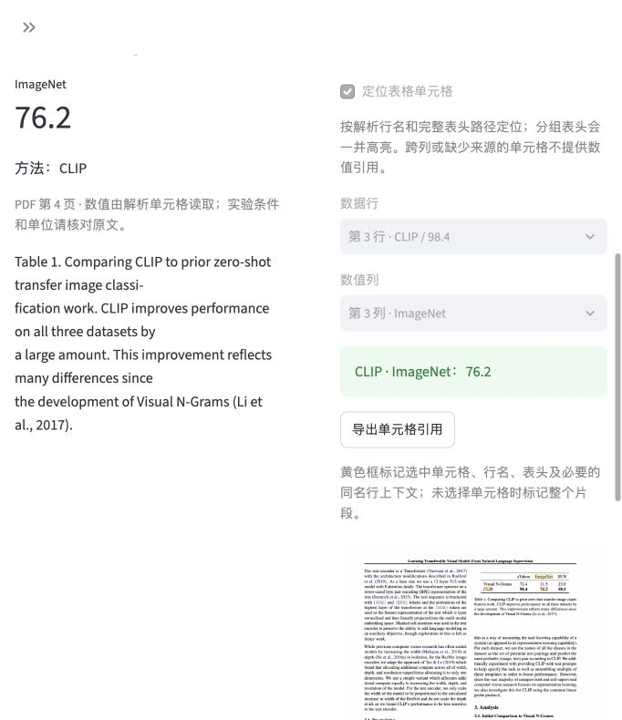

# PaperEvidence 科研论文证据助手

查论文里的实验数值，连同方法、指标和 PDF 原文一起核对。当前是早期本地工具；首次使用可以直接下载 CLIP 官方论文，点一个例子，查看源单元格和高亮，无需 API Key 或模型权重。



截图来自真实浏览器，论文来源与 CC-BY-4.0 署名见 [素材说明](demo/README.md)。关键词、语义和融合检索也可独立使用。

## 已实现

- 文本型 PDF 解析、常见双栏阅读顺序恢复、网格与横线数值表格提取。
- 按方法名与指标名直接查表；宽表、下标方法名和有明确分组横线的两层表头保留来源，行名、完整表头路径与数值一起高亮导出。
- 按常见章节标题、页码、列和内容类型分块；长表格按完整行拆分，重复表头与表注，保留来源坐标。
- BM25 关键词检索，无需 API Key 的原文证据浏览模式。
- 本地 multilingual-e5-small 多语言语义检索、BM25 与语义检索的排名融合。
- 长文本重叠 token 窗口、模型版本记录与向量缓存，检索保留原片段页码和坐标。
- Streamlit 上传、问答、无需提问的逐页浏览、来源区域高亮和 JSON 导出。
- 可选本地 Ollama 或云端兼容 API 生成；逐条校验引用片段、原文引文和数值出现。
- 云端调用证据预算、输出 token 限制与用量记录；拒绝未完成或格式异常的回答。
- 分块对照、中英配对检索评测、真实论文开发集、固定代码的 NLP 扩充检查、自动化测试和 CI 配置。

## 尚未实现

扫描件 OCR、图像理解、公式识别、跨页表格合并、BGE 重排、校准后的拒答策略、真实论文上的答案准确率和幻觉率评测。云端接口通过了离线测试，但尚未使用真实密钥验证模型生成。

表格仍采用首列行名假设；分组表头需有明确的横线几何证据。空白、跨列、多行或来源不完整的单元格不能绑定。NLP 扩充题已用于本轮修复，现明确标为开发集，历史固定代码结果单独保留；标注未独立人工复核。

检索分数不是“答案正确概率”。引文存在也不等于结论得到原文支持。当前不宣称准确率提升或幻觉率下降。

## 启动

推荐 Python 3.11 或 3.12：

```bash
python -m venv .venv
source .venv/bin/activate
python -m pip install -r requirements.txt
streamlit run app.py
```

Windows 激活虚拟环境使用 `.venv\Scripts\activate`。页面默认显示 CLIP 真实论文入口，点击“下载真实论文并开始”，再点“CLIP 的 ImageNet 准确率”。只在点击时下载并校验官方 PDF。下载失败可上传自己的文本 PDF，或选择“虚构演示论文”；后者数值仅为测试数据。

不启用生成模型时，页面展示检索原文。启用本地 Ollama 时，需要先安装 Ollama 并下载适合硬件的模型；在侧栏填写模型名。云端模式需自行配置供应商和环境变量中的密钥。

中文查询英文论文，先准备本地语义模型：

```bash
python -m pip install -r requirements-semantic.txt
python scripts/prepare_embedding.py
```

脚本明确下载约 470 MB 模型权重并固定版本；准备后语义推理在本机执行。在侧栏选择“多语言语义”或“关键词与语义融合”。本工作目录已经准备好模型；源码压缩包不包含权重和虚拟环境。

详细操作见 [配置与使用指南](docs/SETUP.zh-CN.md)。无需将 API Key 发到聊天中。

## 命令行与验证

```bash
python -m paper_evidence ingest examples/demo-paper.pdf --out data/demo.json
python -m paper_evidence ask "What accuracy did the proposed method achieve?" --index data/demo.json
python -m paper_evidence ask "提出的方法准确率是多少？" --index data/demo.json --retriever hybrid --k 3
python -m pip install -r requirements-dev.txt
python -m unittest discover -s tests -v
python eval/retrieval_eval.py --out eval/results.json
python eval/semantic_eval.py
```

评测定义是：标注的“页码 + 原文引文”是否完整出现在 top-k 检索片段中。中英配对示例包含 7 个事实、14 个问题。Evidence Recall@3：BM25 英文为 1.0、中文为 0.0；语义与融合模式在两种语言上均为 1.0。另有 3 个无答案探针，语义检索仍会返回候选。它们是虚构数据上的流程测试，不能证明真实科研质量或拒答能力。

查看 [完整结果](eval/semantic-smoke-results.json) 和 [验证记录](docs/VERIFICATION.zh-CN.md)。

## 查实验数值

输入原表中的“方法或模型名”和“指标名或完整分组路径”，点击“查找数值”。分组表头可输入 `BLEU / EN-DE`；同名列或多个来源会列出候选，必须自己选定。标签只规范空格、大小写、下划线、括号和连字符，不推断方法别名、不计算或换算单位。

示例按钮只存方法和指标标签，调用同一通用查表逻辑，未存答案、页码或坐标。直接查表扫描全部已解析表格，与自然语言 top-k 检索分别评价。查不到不代表原论文没有该数据，可以继续逐页核查。

## 表格单元格引用

检索后在右侧选择表格片段，勾选“定位表格单元格”，选择数据行和数值列。下载真实论文后，可在“示例论文”中选择经过哈希校验的论文。页面会直接从原文读取 `Proposed · Accuracy：91.2%`，标出行名、表头和数值的三个区域，并导出引用坐标。

生成模型引用结构化表格数值时只能选择坐标，不能自行填写行名和数值。未识别为表格的正文仍只有引文和数值出现校验；选择到正确单元格也不等于回答了正确的问题。

## 无需提问的逐页浏览

展开“逐页浏览论文（无需提问）”，勾选打开后按 PDF 页码翻页。可以查看完整原文，或筛选本页全部、正文、已识别表格片段，再检查单元格、导出原文与来源块坐标。没有检索命中、甚至没有可索引文字时仍能浏览；扫描页尚不能检索。表格筛选数量不是论文真实表格数量。

## 真实论文开发集

```bash
python scripts/fetch_real_papers.py
python eval/real_eval.py --out eval/real/v0.5-development-results.json
```

当前选择三篇公开 PMLR 论文、12 个事实的 24 个中英配对问题，另有 3 个无答案探针。保留的 v0.4 结果与本轮回归相同，Evidence Recall@3：BM25 为 18/24，语义为 9/24，融合为 14/24。六个目标表格事实均已恢复来源单元格；12 道配对表格题的单元格 Recall@3 分别为 10/12、7/12、9/12。它们用于开发诊断，不是质量提升或幻觉率下降的证据。

查看 [真实评测报告与失败案例](docs/REAL-EVAL.zh-CN.md)。常见双栏已按列恢复阅读顺序，横线表格保留行列与坐标，长表格按行分块并重复表头和表注。详见 [解析器说明](docs/PARSER.zh-CN.md)，还需独立论文验证。

完整的功能边界见 [英文 README](README.md)，开发和开源路线见 [实施计划](docs/PLAN.zh-CN.md)。

## NLP 表格修复与开发验证

```bash
python scripts/fetch_real_papers.py --dataset eval/nlp
python eval/real_eval.py --dataset eval/nlp --protocol eval/nlp/development-protocol.json --retrievers bm25 --out eval/nlp/v0.5-bm25-results.json
# 准备本地 E5 后，省略 --retrievers bm25 即可比较三种检索器。
```

历史固定代码检查保留在 `eval/nlp/results.json`，证据 Recall@3 为 9/16、6/16、9/16，四个表格事实均未可靠绑定。本轮修复使用了这些失败案例，因此新结果明确是开发验证：四个目标表格事实均可绑定；证据 Recall@3 为 BM25 11/16、语义 6/16、融合 12/16；八道配对表格题的单元格召回为 6/8、4/8、7/8。

查看 [当前报告与边界](docs/TABLE-WORKFLOW.zh-CN.md) 和 [历史固定代码复现](docs/NLP-EVAL.zh-CN.md)。两组小型开发集均未独立人工复核，没有生成模型调用，也不能证明通用质量提升。
