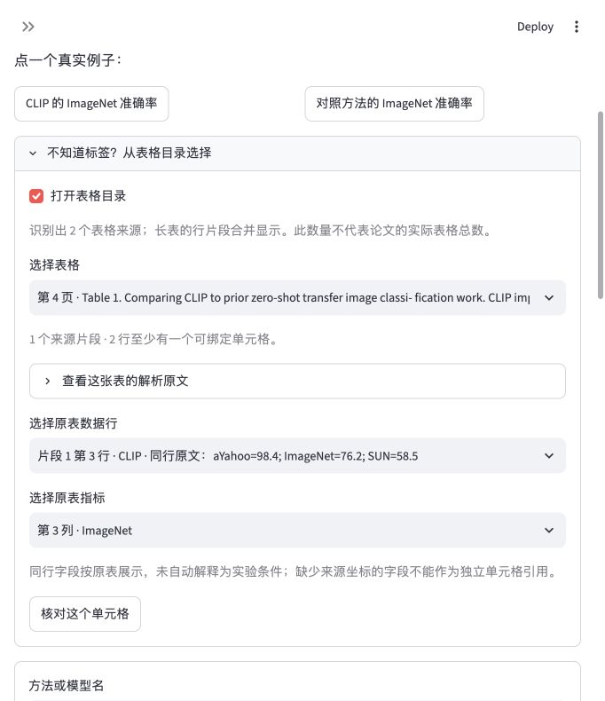

# 表格目录与同行来源字段：v0.5.1

这一轮解决查表的入口问题：读者未必知道表中的方法和指标如何拼写。页面在标签输入前提供表格目录，从已识别结构选表、选行、选指标，再核对源单元格。它不调用生成模型、语义检索或外部服务。

## 使用

1. 展开“不知道标签？从表格目录选择”，勾选“打开表格目录”。
2. 选择包含页码、表注与来源编号的表格。
3. 选择数据行，核对同行字段；重复方法名也显示其他文字和数值列。
4. 选择完整指标路径，点击“核对这个单元格”。源值、高亮及单元格导出与此前查表流程共用。
5. 展开“查看同行字段与上方分组原文”，可导出单独的 `source-row.json`。

实际浏览器完成了 CLIP 目录中的表格、行、指标选择并核对返回值和来源显示。新同行字段导出的数据由纯函数与 AppTest 检查，本轮没有把它说成实际浏览器下载验收。截图的论文来源、作者与 CC-BY-4.0 说明见 [素材署名](../demo/README.md)。

## 来源区分与边界

目录只按同一文档、页码和原始块标识合并长表片段，不能凭表注或表头相同合并两个表格。行索引标为片段局部行号，不冒充完整论文表格行号。数据行和指标都需要显式选择；可引用列仅来自已有 `cell_reference` 检查，跨列、缺少坐标或不完整分组不会在目录中变成可引用值。

多个标签查询候选增加表注、列号和同行字段，帮助区分同页同名方法；只有用户选定来源后才显示值。同行字段按原文导出，包含每一列的文字和可用字符框。缺少坐标时保持空值，上方分组文字不补造坐标。目录没有推断实验条件、单位、方法别名或结论支持。

目录含已识别结构，即使某结构没有可绑定单元格，也能展开解析文本和完整 PDF；预览失败显示提示。没有结构时仍可逐页浏览。目录数量和可绑定行数不等于论文实际表格数或完整提取率。

## 验证

94 项自动化测试覆盖长表片段合并、同表注的不同来源不合并、重复指标完整路径、跨片段同名方法的数字字段区分、缺少几何来源拒绝、目录必须选行和指标、目录来源切换、查无匹配后的标签发现、空目录以及原页预览失败时保留文本。

解析、分块、检索、原单元格引用和两组 v0.5 评测所记录的核心代码哈希均未变化。本轮没有重跑或更新质量指标；已有结果继续属于开发集，不能从目录体验推导独立论文的质量提升。仍需要独立用户与未参与开发的论文验证。
