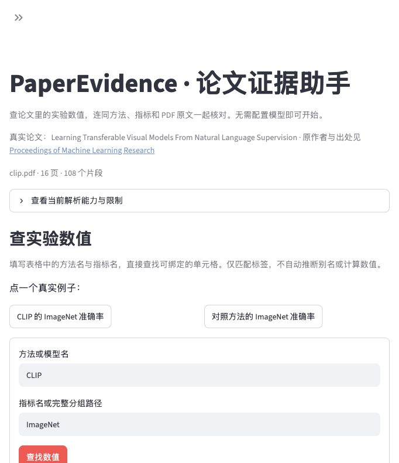

# 实验数值查表与来源核对：v0.5 开发记录

本轮首次体验收敛为：从真实论文选择方法和指标，读取源单元格，查看行名、完整表头路径、数值及原页高亮，导出引用 JSON。直接查表不需要 API Key、生成模型或语义权重。

## 首次使用与验证

页面默认出现 CLIP 真实论文入口。点击“下载真实论文并开始”才从官方出处下载；启动不联网下载。已有文件校验 SHA256 后复用，非法 PDF、大小超限或哈希不符不会替换原文件。失败可重试、上传自己的文本 PDF，或选择明确标注为虚构数据的示例。

点击真实例子，或在“查实验数值”输入原表方法与指标。分组指标可用 `BLEU / EN-DE`。标签只规范大小写、空格、下划线、括号和连字符，不推断别名、换算单位或计算结果。多个来源初始不选任何一个；查不到不表示论文没有数据。示例只存标签，没有答案、页码或坐标，和手动输入共用 `find_cells`。扫描全部已解析表格的成功率不能当成自由问题 top-k 召回。




截图来自本机实际浏览器。实际点击导出并核对 JSON 的页码、方法、指标、值与三个来源区域。其他页面状态、多候选选择由 Streamlit AppTest 验证，不混称浏览器验收。论文作者、出处及 CC-BY-4.0 署名见 [素材说明](../demo/README.md)。

## 解析与回归

宽表的任务标题、数字备注分开保存；根据字符高度、重合及相邻距离保留方法名下标。重复列标签通过明确的部分横线建立父级关系，保存各层实际字符框。已渲染完整相关页，目视核对 BERT 与 Transformer 四个目标的行名、指标、分组和值。

规则不含论文名或标注答案。跨列数据保留文本但不提供绑定坐标；不唯一或无来源的分组回退。回归发现无名称行标题会把首个指标错当行名，已补数字位置校验与独立虚构 PDF 测试。旧单层横线规则保留为补充。详见 [解析器边界](PARSER.zh-CN.md)。

83 项自动化测试通过；七道虚构检索流程题的固定窗口与章节分块召回仍均为 1.0。新增覆盖分组高亮、同名列不默认选、缺失来源拒绝、跨列值拒绝、表头备注、旧索引兼容、首次启动不下载与下载哈希失败。schema 3 保存表头路径，schema 1/2 仍可加载，需重新导入才有新结构。

## 开发结果与历史保留

此前 NLP 协议、标注与结果未覆盖。修复已使用这些题，新 `development-protocol.json` 明确开发用途并要求单独输出路径。历史检查需检出 `474108757fc41ccbd5263a9a2033b0ff9e017d08`，不能用当前解析器冒充历史运行。

实际 CPU E5 运行，同一模型提交、1400 字符目标分块、k=3，无生成调用。证据指标要求引文和源区域；单元格指标还要求方法、叶子指标、必要父级和值相符。

| 语料与版本 | BM25 证据 | E5 证据 | 融合证据 | BM25 单元格 | E5 单元格 | 融合单元格 |
| --- | --- | --- | --- | --- | --- | --- |
| NLP 历史 v0.4.1 | 9/16 | 6/16 | 9/16 | 0/8 | 0/8 | 0/8 |
| NLP 当前开发 | 11/16 | 6/16 | 12/16 | 6/8 | 4/8 | 7/8 |
| 原三篇 v0.4 | 18/24 | 9/24 | 14/24 | 10/12 | 7/12 | 9/12 |
| 原三篇本轮回归 | 18/24 | 9/24 | 14/24 | 10/12 | 7/12 | 9/12 |

NLP 完整索引中四个独立表格事实均可绑定；八道配对题不等于八个独立事实。BM25 中文证据仍只有 3/8，语义 BERT 证据为 0/8，融合仍有遗漏。两组语料都参与开发，标注由 agent 制作，未独立人工复核；这些结果不证明泛化、答案正确率或幻觉率改善。

```bash
python scripts/fetch_real_papers.py --dataset eval/nlp
python eval/real_eval.py --dataset eval/nlp --protocol eval/nlp/development-protocol.json --out eval/nlp/v0.5-development-results.json
python scripts/fetch_real_papers.py
python eval/real_eval.py --dataset eval/real --out eval/real/v0.5-development-results.json
```

加 `--retrievers bm25` 可免权重运行，建议另选输出文件。原始结果含代码、标注、PDF、协议哈希：[NLP 开发结果](../eval/nlp/v0.5-development-results.json)、[原三篇回归](../eval/real/v0.5-development-results.json)、[历史协议](NLP-EVAL.zh-CN.md)。

仍需未参与开发的论文和独立标注者验证不同排版、实验条件与单位。无边框复杂表格、跨页合并、扫描件 OCR、公式结构、生成答案和校准拒答未在本轮实现或验证。
